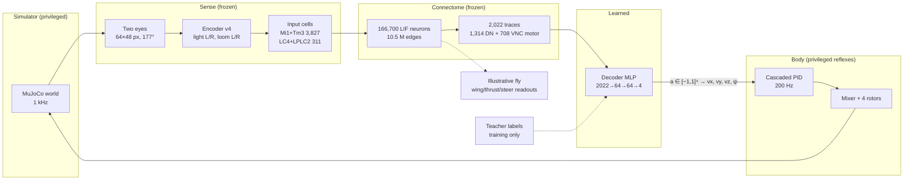
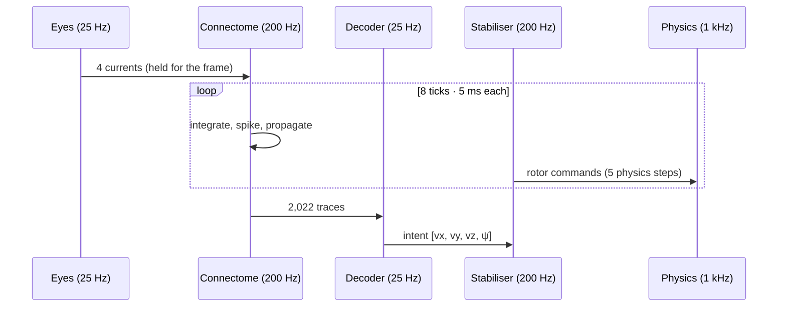

# Fly / Drone overview: a fly connectome as the brain of a drone

> **Goal.** The fly's connectome is the brain, and the drone is its body: a cyborg. A frozen
> 166,700-neuron MaleCNS connectome sees through the drone's cameras, and the drone moves
> because of what the brain's descending and motor neurons do. The drone contributes reflexes
> (stabilisation), never decisions.

For diagrams, open [`architecture.html`](architecture.html) in a browser. This file is the
written companion: architecture, math, training, evidence and roadmap. The deep references are
[`../architecture.md`](../architecture.md), [`../sensory-model.md`](../sensory-model.md),
[`../neuron-model.md`](../neuron-model.md), [`../control-and-physics.md`](../control-and-physics.md),
[`../training.md`](../training.md), [`../free-roam.md`](../free-roam.md) and
[`../validation.md`](../validation.md). External navigation-connectome findings, and what this
project does with them, are in [`../connectome-navigation-findings.md`](../connectome-navigation-findings.md).
Projects that put a fly connectome in a body, and the pieces this project takes from them, are in
[`../external-prior-art.md`](../external-prior-art.md).

## 1. The goal, stated as a contract

**The connectome is the brain; the body is an embodiment, not the intelligence.** Today the body is
a simulated quadrotor — the cyborg milestone. The fidelity reference is the fly's own biomechanical
body (`flybody`/NeuroMechFly); the deployment target is a physical drone. The v1 method, the staged
contract changes (body feedback, fitted dynamics) and the cleanup are specified in
[`../superpowers/specs/2026-09-19-body-agnostic-fidelity-cyborg-design.md`](../superpowers/specs/2026-09-19-body-agnostic-fidelity-cyborg-design.md).

"The brain controls the body" is easy to fake: script the body and let the neurons flicker on a
screen. Each clause below exists to rule out one way of faking it.

| Clause                                                                                                                                                                                                     | Rules out                                                                    | Enforced by                                                                 |
| ---------------------------------------------------------------------------------------------------------------------------------------------------------------------------------------------------------- | ---------------------------------------------------------------------------- | --------------------------------------------------------------------------- |
| **Only neurons reach the bridge.** The body bridge's input is the 2,022 descending + VNC motor traces (plus declared body feedback once C1 lands).                                                         | A bridge that secretly reads pose, target position or pixels                 | `BrainRuntime.features`, actor identity binding                             |
| **The connectome is frozen.** Wiring, weights, signs, neuron parameters and tonic bias never change; fitted dynamics and feedback are additive identities.                                                 | "Training the brain" into an arbitrary network that merely has 166,700 units | the declared adapter and the deprecated learned path update only the bridge |
| **One bridge, no mode switch.**                                                                                                                                                                            | A hidden state machine choosing behaviours                                   | the server loads one bridge (declared by default) for free roam             |
| **Feedback informs, never decides (C1).** Ascending/proprioceptive inputs (declared in `feedback-mappings.json`) are an opt-in, versioned additive identity (`bundle_hash`, alternate).                    | A body that hands the brain targets or actions instead of its own state      | alternate-bundle pin; the `feedback-check` silencing gate                   |
| **The body only executes.** The PID keeps the drone upright and tracks the intended velocity.                                                                                                              | A planner in the body                                                        | the PID sees true state but receives only velocity intent                   |
| **Skills are causal.** A skill counts only if silencing its pathway removes it, and a blind (ghost) brain cannot pass by chance.                                                                           | Behaviour that would happen anyway, such as drifting out of a ball's path    | pre-registered `roam_eval.ACCEPTANCE`                                       |
| **Honest labels.** Any label uses simulator geometry only for objects the eyes can see; the default bridge uses no teacher at all.                                                                         | Asking neurons to encode information that never entered them                 | `teacher.visible`, range gates                                              |
| **Liveness comes from the brain.** Ongoing motion must trace to tonic drive on identified neurons, excitability or noise — never to a constant in the bridge. Each is declared, versioned and silenceable. | A bridge constant that fakes life and that no ablation can remove            | the C3 silencing gates; `free-roam.md` §4 records the reversed precedent    |

**Where the goal leads.** The same brain should forage for light, avoid pillars and walls, and
dodge thrown objects in arenas it has never seen, with every skill attributable to neurons.
After that: body feedback into the connectome through ascending neurons, richer senses, and
onboard compute running the full graph (§10).

**What is not biological, and is declared as such.** The visual encoder is an engineered adapter
(two image statistics per eye). The body bridge is an engineered translation, because flies have
wings, not rotors: by default a declared, calibrated adapter (no teacher), with the learned
decoder/encoder retained as a deprecated option. The stabiliser uses ideal simulated state.

## 2. System at a glance

| Layer                          | Code                                                | Frozen or learned          |
| ------------------------------ | --------------------------------------------------- | -------------------------- |
| Rendering, physics, rotors     | `python/fly_drone/plant.py`, `vendor/mujoco-drones` | simulator                  |
| Encoder (pixels → 4 currents)  | `crates/brain-core/src/vision.rs`                   | frozen (`ENCODER_VERSION`) |
| Connectome (LIF)               | `crates/brain-core`                                 | frozen                     |
| Feature readout (2,022 traces) | `python/fly_drone/brain.py`                         | frozen                     |
| Decoder (actor)                | `training.py`, `distill.py`, exported to Rust       | **learned**                |
| Stabiliser                     | `plant.py`, `stabiliser.py`                         | fixed, privileged          |
| Teacher, reward, evaluation    | `teacher.py`, `env.py`, `roam_eval.py`              | simulator, offline only    |

## 3. Senses: pixels to input currents

Two 64 × 48 px cameras are splayed ±0.75 rad, which gives a 177° field with a ±2.6° binocular
overlap. For each eye (P = 3,072 px), using Rec. 709 luma $Y \in [0,1]$:

$$
B = \frac{1}{P}\sum_{px} 400\,\max(0,\,Y-0.55), \qquad D = \frac{1}{P}\sum_{px} \mathbb{1}[Y<0.18]
$$

$$
c_\text{light} = \operatorname{clamp}\!\big(1.5B + 6\max(0,\,B-B'),\,0,\,2\big), \qquad
c_\text{loom} = \operatorname{clamp}\!\big(150\max(0,\,D-D'),\,0,\,2\big)
$$

The four currents `[light_l, light_r, loom_l, loom_r]` are injected into anatomically annotated cells:

| Role        | Cells | Types               |
| ----------- | ----: | ------------------- |
| `light_l`   | 1,903 | Tm3 1,017 · Mi1 886 |
| `light_r`   | 1,924 | Tm3 1,037 · Mi1 887 |
| `looming_l` |   165 | LPLC2 94 · LC4 71   |
| `looming_r` |   146 | LPLC2 91 · LC4 55   |

**Why dark-area growth reads as looming.** An object of radius $R$ at distance $d$ subtends
$\theta \approx 2R/d$, so its image area is $D \propto 1/d^2$. Closing at speed $v$ gives
$\dot D \propto 2v/d^3$, which rises steeply near contact, like the time-to-contact tuning attributed
to LC4/LPLC2. With gain 150 the looming cells fire at about 1.5–2 m.

This encoder v4 is a fixed adapter, used by every legacy task. Free roam instead flies a **learned**
encoder v5: a small CNN over each eye's 3-frame luma stack, driving 8 anatomical populations
(Mi1, Tm3, LC4, LPLC2 per side) instead of 4 pooled cues. See
[`../sensory-model.md` §6](../sensory-model.md#6) for the network, channel table and identity scheme.

## 4. Brain: the frozen connectome

Leaky integrate-and-fire neurons, exact per-tick integration with $\Delta t = 5$ ms and $\tau_m = 20$ ms:

$$
v_i(t{+}1) = e^{-\Delta t/\tau_m}\,v_i(t) + I^\text{syn}_i(t) + I^\text{inj}_i(t) + b_i + \sigma\xi_i(t),
\qquad \text{spike and reset if } v_i \ge 1
$$

$$
I^\text{syn}_j(t{+}1) \mathrel{+}= \sum_{i \to j} q_{ij}\, w_\text{norm}\, \text{sign}_i, \qquad w_\text{norm}=0.003
$$

Signs follow each neuron's predicted transmitter (ACh +1; GABA and glutamate −1). Every synapse
delays by exactly one tick. The decoder reads a 200 ms exponential activity trace, which is the
brain's short-term memory.

| Neuron group                                 |     Count | Share |
| -------------------------------------------- | --------: | ----: |
| optic lobe intrinsic                         |    89,403 | 53.6% |
| central brain intrinsic                      |    32,164 | 19.3% |
| VNC intrinsic                                |    13,161 |  7.9% |
| visual projection                            |     9,201 |  5.5% |
| sensory (optic lobe, VNC, central brain)     |    17,336 | 10.4% |
| **descending neurons**                       | **1,314** |  0.8% |
| **VNC motor neurons**                        |   **708** |  0.4% |
| other (ascending, centrifugal, endocrine, …) |     3,413 |  2.0% |

Details: [`../neuron-model.md`](../neuron-model.md).

## 5. From neurons to rotors: what the drone is told

**Which fly actions map to the drone?** No neuron is hand-assigned to a rotor or an axis. A fly
steers with wings, and a quadrotor has four velocity-like degrees of freedom, so some engineering
translation is unavoidable. By default that translation is a **declared, calibrated adapter**
([`adapter.py`](../../python/fly_drone/adapter.py), P0): a fixed map from a small set of neural
readouts to the motion intent, calibrated on a declared stimulus battery with no teacher. The
learned decoder below is retained but deprecated.

The deprecated learned path maps the activity of the cells that carry the brain's motor commands
(all 1,314 descending neurons and 708 VNC motor neurons) through a small MLP decoder to the same
motion intent:

$$
\hat x = (f - \mu) \oslash \sigma, \qquad
a = \operatorname{clamp}\!\big(W_3 \tanh(W_2 \tanh(W_1 \hat x + b_1) + b_2) + b_3,\,-1,\,1\big)
$$

$$
u = a \odot [0.7,\ 0.5,\ 0.3,\ 0.8] = [v_x\ (\text{m/s}),\ v_y,\ v_z,\ \dot\psi\ (\text{rad/s})]
$$

| Axis               | Drone motion   | Free-roam limit | Legacy-room limit |
| ------------------ | -------------- | --------------: | ----------------: |
| $a_0 \to v_x$      | forward / back |         0.7 m/s |           0.4 m/s |
| $a_1 \to v_y$      | sidestep       |         0.5 m/s |           0.4 m/s |
| $a_2 \to v_z$      | climb / dive   |         0.3 m/s |           0.2 m/s |
| $a_3 \to \dot\psi$ | turn           |       0.8 rad/s |         0.8 rad/s |

The declared adapter steers from the left/right laterality of the 2,022 descending/motor traces plus
the `escape` and power readouts. The remaining anatomical readouts (wing, thrust, steer; 2–30 cells
each) drive only the illustrative fly in the viewer and have no effect on the drone.

**Body.** Velocity intent integrates into a bounded position-hold setpoint. A cascaded PID (position
→ attitude → torques) and a mixer produce four rotor speeds. Vertical is direct thrust. Lateral
motion needs the airframe to tilt first, so it is slower. Measured time to reach 80% of a commanded
step is 0.69 s vertical and 1.48 s lateral (`docs/results/roam-step-response.json`).

**Clocks.** Physics runs at 1 kHz, brain and PID at 200 Hz, camera and decoder at 25 Hz. One decision
takes 40 ms, 8 neural ticks and 40 physics steps.

## 6. The free-roam world

A 16 × 16 m room with 3 m walls carrying a dark band, up to 16 ringed pillars, one glowing beacon at a
time (half spawn out of view, so the drone must search), and at level 3 dark balls thrown at the drone.
Threats launch 3–4 m ahead at 0.9–1.3 m/s on an intercept course that leads the drone's velocity.
Crashes respawn the drone without resetting the brain. Full tuning evidence: [`../free-roam.md`](../free-roam.md).

## 7. How the decoder learns (and yes, it is RL)

Two stages, both touching **only the decoder**.

### 7.1 Imitation warm start: DAgger

RL from scratch on 2,022 noisy traces is sample-hungry. A composite **teacher** gives a target
action from simulator geometry, but only for objects the eyes could see:

| Drive    | Fires when                                 | Label                                                                                    |
| -------- | ------------------------------------------ | ---------------------------------------------------------------------------------------- |
| Evade    | threat in view, unoccluded, within 2 m     | back off 0.5, sidestep away, **climb** (dive near the ceiling), side committed per throw |
| Avoid    | pillar < 1.2 m or wall < 2.0 m inside ±35° | full turn away, committed until clear; forward ∝ clearance                               |
| Approach | beacon in view, unoccluded, < 12 m         | yaw 1.5β, forward when facing                                                            |
| Explore  | nothing salient                            | forward 0.8, random yaw cast resampled every 1.5–3.5 s                                   |

DAgger alternates **collect** and **fit**. In iteration $k$ the drone is flown by the teacher with
probability $\beta_k$ and by the current student otherwise, while the teacher always writes the label.
The student therefore learns to recover from its own mistakes.
$\beta = 1 \to 0.5 \to 0.25 \to 0$. The fit is drive-balanced regression, so rare threat frames
count as much as idle flight:

$$
\mathcal L(\theta) = \frac{1}{|B|}\sum_{t\in B} w_{\text{drive}(t)}\,\big\lVert m_\theta(\hat x_t) - y_t\big\rVert^2,
\qquad w_k \propto \frac{1}{n_k},\ \ \overline{w} = 1
$$

The fit uses Adam at 1e−3 for 4,000 steps with batch 256, and 10% of flights held out with per-drive R².
Exploration std is then set small ($\log\sigma_\pi = -2.5$), so PPO starts at the clone.

### 7.2 Reinforcement learning: PPO

PPO fine-tunes the cloned decoder in closed loop on the free-roam reward (per 40 ms step):

$$
\begin{aligned}
r_t ={}& 0.05 - 0.05\lVert a_t\rVert^2 + 20\cdot\mathbb 1[\text{beacon}] + 2\,(d_{t-1}-d_t)\,\mathbb 1[\text{beacon seen}] + 0.5\cdot\mathbb 1[\text{new 1 m cell}] \\
&- 2\,e^{-c_t^2/0.2} - 2\max(0,\,|z_t-1.1|-0.5)^2 - 20\cdot\mathbb 1[\text{collision, tilt, bounds, altitude}]
\end{aligned}
$$

Here $d$ is the distance to the beacon and $c$ is the clearance to the nearest pillar or wall. Progress
pays only while the beacon is visible, so luck is not rewarded. Clipped surrogate with GAE:

$$
\rho_t = \frac{\pi_\theta(a_t\mid o_t)}{\pi_{\theta_\text{old}}(a_t\mid o_t)},\quad
L^\text{CLIP} = \mathbb E_t\big[\min(\rho_t \hat A_t,\ \operatorname{clip}(\rho_t,1\pm0.2)\hat A_t)\big],\quad
\hat A_t = \sum_l (\gamma\lambda)^l \delta_{t+l}
$$

with $\gamma = 0.99$, $\lambda = 0.95$. Free-roam PPO environments run the level-3 arena with respawn,
and exported actors carry the arena limits (`training.action_limits`).

### 7.3 Could the encoder be learned too?

Only with evidence, and now there is some. The free-roam feasibility gate failed for thrown
threats (`runs/roam/feasibility-climb.json`, loom-history diagnostic, 8 × 60 s): the v4 loom cue
triggered 385 escapes with **no** threat in flight, at a median loom level of 0.49 — _higher_ than
the 0.44 median level at trigger when a threat actually was in flight. `150 · max(0, ΔD)` responds
as strongly to self-motion past banded walls and pillars as to a ball 3–4 m away, and the brain
receives only four pooled scalars, so no decoder can recover the distinction the encoder
discarded. The user chose to **learn** the encoder with RL (SAC), keeping the connectome frozen and
the encoder's input to camera pixels only. Design: [`superpowers/specs/2026-09-14-learned-encoder-sac-design.md`](../superpowers/specs/2026-09-14-learned-encoder-sac-design.md).
This invalidated every accepted free-roam actor, which is re-validated against E1–E4 (§8) before
acceptance; legacy actors stay pinned to v4 and are untouched.

### 7.4 Encoder v5: alternating SAC rounds

One `ConnectomeEnv` gives two views: the encoder's observation is its eye stack (8 currents out),
the decoder's is the 2,022 DN + VNC motor traces (4 velocities out). Because the brain has hidden
state, pixels alone are not Markov for the encoder, so its **critic** (training only, discarded
afterwards) also reads the DN traces plus threat/beacon geometry relative to the drone — but only
while that object is inside a camera's field of view and unoccluded (`teacher.visible` /
`env.beacon_visible`), so even the training-only critic never sees more than the eyes could.
Nothing from the critic reaches the deployed encoder or decoder.

Stages, all at level 3 except stage 1:

1. **DAgger on L2** — warm-start a decoder against v4 cues with no threats present, so it never
   learns to dodge walls.
2. **v4 clone** — supervised copy of v4's four cues onto the 8 v5 channels, so the decoder's inputs
   look familiar to it from the very first SAC step.
3. **Round-0 decoder** — the stage-1 decoder re-exported through the v4-clone encoder (warm start,
   not trained).
4. **3 alternating rounds** — per round, encoder SAC (decoder frozen, 350 k frames) then decoder SAC
   (encoder frozen, 150 k frames). The two are never trained jointly: if the decoder stayed frozen
   for the whole run, the encoder's only path to reward would be finding brain states the frozen
   decoder happens to map to a dodge, i.e. using the connectome as a wire. Alternating lets the
   decoder learn to read loom-driven activity while the encoder learns to produce it.
5. **Evaluation** — A1–A7 unchanged, plus E1–E4 (§8).

Both learners use SB3 SAC with an asymmetric critic and the maximum-entropy objective:

$$
J(\pi) = \mathbb E\Big[\sum_t \gamma^t \big(r_t + \alpha\, \mathcal H(\pi(\cdot\mid o_t))\big)\Big],
\qquad
y = r + \gamma\big(\min_j \bar Q_j(s', a') - \alpha \log \pi(a'\mid o')\big)
$$

with $\gamma = 0.99$, batch 256, 2 gradient steps per environment step, and a replay buffer of
100,000 transitions. Commands: [`../training.md`](../training.md) §9.

**Encoder v6 (retinotopic).** The v5 8-scalar encoder was found unable to carry loom selectivity
(E1 0.686 vs the 0.8 bar) and the Phase-2 ladder did not forage. v6 replaces the 8 uniform scalars
with **per-patch current maps**: a CNN over each eye's luma stack (plus explicit frame
differences) drives `12×8` maps for Tm4/T2 (motion/loom) and Mi1/Tm3 (light), and `4×3` maps for
the direct LC4/LPLC2 route — 816 currents/frame injected patch by patch, so the connectome's own
optic lobe computes motion and looming. The connectome, the decoder and `ACCEPTANCE` are
unchanged; v6 is `learned-v6:` and additive. See [`../sensory-model.md`](../sensory-model.md) §7.

## 8. Proving the brain is flying: evaluation

`fly-drone evaluate --task free_roam` flies 50 held-out seeds for 120 s under seven brain conditions:
intact, zeroed features, shuffled features, all vision silenced, light silenced, loom silenced, and
ghost objects (visible to physics, invisible to the eyes). It also flies teacher, cue-script and
random baselines.

| ID  | Pre-registered criterion                                                                            |
| --- | --------------------------------------------------------------------------------------------------- |
| A1  | beacons/min ≥ 0.6 × teacher and ≥ 2 × best of zeroed/shuffled/vision-silenced/light-silenced/random |
| A2  | collisions/min ≤ 0.5 and ≤ 0.5 × min(loom-silenced, ghost)                                          |
| A3  | threat dodge ≥ 0.8 overall and on each side; ghost dodge ≤ 0.3 (throws that hit or came within 2 m) |
| A4  | light silencing cuts beacons ≥ 50%; loom silencing doubles collisions and keeps ≥ 50% of beacons    |
| A5  | in-arena skill probes                                                                               |
| A6  | coverage ≥ 0.4, slow fraction ≤ 0.1, yaw bias ≤ 0.25                                                |
| A7  | live server ≥ 1× real time                                                                          |

A3's ghost clause is the check that a dodge really proves sight: if balls can be escaped blind, the
dodge rate says nothing about the brain.

## 9. Where we are

| Milestone                            | Status          | Evidence                                                                                                                                                           |
| ------------------------------------ | --------------- | ------------------------------------------------------------------------------------------------------------------------------------------------------------------ |
| Visual steering (trial room)         | ✅ accepted     | 100%, balanced 1.00; ablations 0.00/0.00/0.17                                                                                                                      |
| Looming avoidance (trial room)       | ✅ accepted     | 96%, balanced 0.92                                                                                                                                                 |
| 0 · Encoder v4 sufficiency           | 🟡 v5/v6 chosen | gate failed (385 false loom escapes/8 min, level 0.49 vs 0.44); v5 code + rounds done (E1 0.686, no foraging), v6 retinotopic code landed, training pending (§7.4) |
| 1 · Viewer diagnostics               | ✅              | axes, heading, velocity, command vectors                                                                                                                           |
| 2 · Body step response               | ✅              | vertical 0.69 s vs lateral 1.48 s to 80%                                                                                                                           |
| 3 · Teacher redesign                 | ✅              | climbing evade; committed avoid turn (collisions 2.0 → 0.1/min); random search cast                                                                                |
| 4 · Teacher gate (A3 on the teacher) | 🟡 dodge passed | A3 confirmed below; collision and foraging check (`roam-feasibility`) running                                                                                      |
| 5 · DAgger → PPO → evaluation        | next            | asks the user before long runs                                                                                                                                     |

Threat aim decides whether dodging can prove sight (near-throw scoring, 10 seeds × 60 s, level 3):

| Throw aim                    | Teacher dodge |  Worst side | Blind teacher | Random |
| ---------------------------- | ------------: | ----------: | ------------: | -----: |
| at launch position           |          0.96 |        0.90 |   **0.57** ❌ |   0.45 |
| ahead of the drone (current) |   **0.90** ✅ | **0.83** ✅ |   **0.12** ✅ |   0.68 |

Confirmation on 20 fresh seeds (6000–6019, `runs/roam/screen-5-lead-confirm.json`), aim ahead:

| Controller             | Near throws | Dodge | Left | Right | Collisions/min |
| ---------------------- | ----------: | ----: | ---: | ----: | -------------: |
| teacher, sees threats  |          46 |  0.96 | 1.00 |  0.92 |            0.4 |
| teacher, ghost threats |          53 |  0.26 | 0.27 |  0.25 |            2.2 |
| random                 |          69 |  0.57 | 0.62 |  0.51 |            1.5 |

A3 passes on the teacher (≥ 0.8 overall and per side; ghost ≤ 0.3). The ghost margin is thin (0.26
vs 0.3), so a trained decoder's own ghost rate needs watching. Random flight dodging 0.57 does not
enter A3, but it shows that erratic movement escapes some throws: a decoder that jitters could look
better than it is, and the ghost condition is what catches that.

## 10. Next

**Where the v1 route stands.** P0 declared adapter — landed, gate negative
(`docs/results/adapter/FINDING-2026-09-19.md`). P1 ascending feedback — landed, weak positive on
`slow_fraction` only (`docs/results/feedback/FINDING-2026-09-19.md`). P2 connectome-constrained
dynamics — infrastructure landed, declared prior negative, but only `noise_sigma` was ever varied,
so the per-neuron lever is untested (`docs/results/dynamics/FINDING-2026-09-19.md`). P3 liveness bar
— landed and kept; the optic-flow relay is a recorded negative
(`docs/results/liveness/FINDING-2026-09-20.md`).

**P4 closed 2026-09-20 (negative with a real positive inside it)**, specified in
[`../superpowers/specs/2026-09-20-ongoing-state-and-faithful-readout.md`](../superpowers/specs/2026-09-20-ongoing-state-and-faithful-readout.md).
The drone idled for a measured reason, not a mysterious one:

1. **The codec could not command a speed that counts as moving.** With the committed
   `g_fwd = 0.69203` and `rest_power = 0.439525`, no declared stimulus but a full one-sided loom
   commanded more than the 0.05 m/s threshold; a bright light in both eyes commanded 3 cm/s.
2. **The brain has no ongoing activity.** Exactly one population carries tonic drive (DLMn/DVMn,
   `b = 0.85`); the other 166,698 neurons sit at `bias = 0` under a unit threshold.
3. **9,189 neurons (5.5 %) transmit nothing** — every out-edge weight is zero for histamine,
   dopamine, octopamine, serotonin and unresolved transmitters. Restoring modulatory transmission
   needs an upstream bundle rebuild and is deferred.
4. **The liveness bar could not see the complaint.** L1/L2 were teacher-anchored and blind to
   motion structure; they are now re-anchored on published fly free-flight statistics (L6–L8).

**What P4 found.** Codec v2 (steering from the wing steering motoneurons, two-sided drive,
span-normalised) fixes the idling: on the canonical bundle `slow_fraction` fell 0.444 → 0.031 and
coverage rose 2.1 % → 10.4 %, causally. C3a tonic drive on the steering motoneurons was **rejected**
by its silencing gate (no metric changed); C3b excitability was **dropped** for lack of a citable
resting baseline. No cell passed L1–L8, but a follow-up free audit showed the **L7** failure is a
**body** gap: the saccade detector fires at 3 rad/s while the quadrotor's yaw authority is 0.8 rad/s,
so no controller — not even the accepted RL teacher — can register a saccade. L7 is therefore
**deferred** on the drone body (reported and excluded from `passed`, automatically re-enabled when a
fly-like body raises the yaw authority), the fly's value kept as that milestone's target. On the
definitive 15-seed **120 s** run, the v2 codec clears L1–L8 except **L4**: the blind (ghost) body is
nearly as alive (coverage 0.177 vs 0.189), because locomotion is the brain's own tonic drive and
vision only steers. By user decision the bar is left as pre-registered and L4 stands as a **recorded
near-miss** (liveness is intrinsic, not vision-attributable); P4 closes here. Evidence:
[`../results/liveness/FINDING-2026-09-20-c3-and-codec-v2.md`](../results/liveness/FINDING-2026-09-20-c3-and-codec-v2.md),
[`../results/liveness/FINDING-2026-09-20-l7-body-threshold.md`](../results/liveness/FINDING-2026-09-20-l7-body-threshold.md),
[`../results/liveness/FINDING-2026-09-20-l2-coverage-and-l4-attribution.md`](../results/liveness/FINDING-2026-09-20-l2-coverage-and-l4-attribution.md).
`ACCEPTANCE` A1–A7 were untouched.

**Shipped default.** Codec v2 is now the default declared bridge (the simulation no longer idles
out of the box). Use `fly-drone serve --codec v1` (or `--adapter v1`) to fly the legacy canonical
codec, or the viewer's free-roam **bridge → Codec** switch, which swaps the bridge and resets the
sim live. The canonical `adapter.json` and `adapter-check.json` are unchanged.

**Alive ≠ capable.** On the A1–A7 skill gate the new default fails every capability criterion (A1
beacon rate 0.033/min vs teacher 0.733; A2 collisions 6.67/min vs ≤0.5; A3 dodging not causal;
A4/A5 loom steering absent; A6 coverage 0.185 vs 0.4). v2 fixed the idling (A6 `slow_fraction`
0.62 → 0.03) but traded it for collisions and lost loom causality, because the readout carries no
target-seeking or threat-avoidance signal. The next workstream is closed-loop senses/feedback into
the connectome (C4+). Evidence:
[`../results/adapter/FINDING-2026-09-20-v2-acceptance.md`](../results/adapter/FINDING-2026-09-20-v2-acceptance.md).

**Next: C4 — use the escape response, make loom selective.** A free audit shows the connectome does
sense a looming object (its `escape` readout fires ~0.9, like the teacher), but the bridge commands a
climb and a `0.5·yaw` sidestep instead of the teacher's full lateral escape, and has no wall
avoidance. The C4 spec
([`../superpowers/specs/2026-09-20-c4-escape-and-loom-selectivity-design.md`](../superpowers/specs/2026-09-20-c4-escape-and-loom-selectivity-design.md))
adds C4a (lateral escape from the brain's response) and C4b (a selective, v6-spatial loom front-end),
each declared, silenceable and falsifier-first. Evidence:
[`../results/adapter/FINDING-2026-09-20-loom-escape-audit.md`](../results/adapter/FINDING-2026-09-20-loom-escape-audit.md).

**Further out:** senses beyond two luminance statistics; the sim-to-real transfer package; a
fly-like body (`flybody`/NeuroMechFly); onboard compute running the full graph (estimate:
[`../hardware-estimate.md`](../hardware-estimate.md)). A state-in-synapses (path-integration)
milestone that would require opt-in plasticity is scoped, and deliberately not scheduled, in
[`../connectome-navigation-findings.md`](../connectome-navigation-findings.md) §6.
