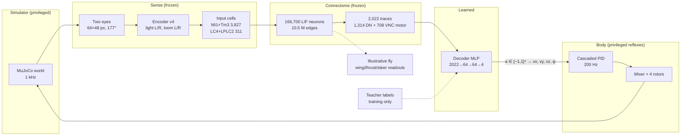
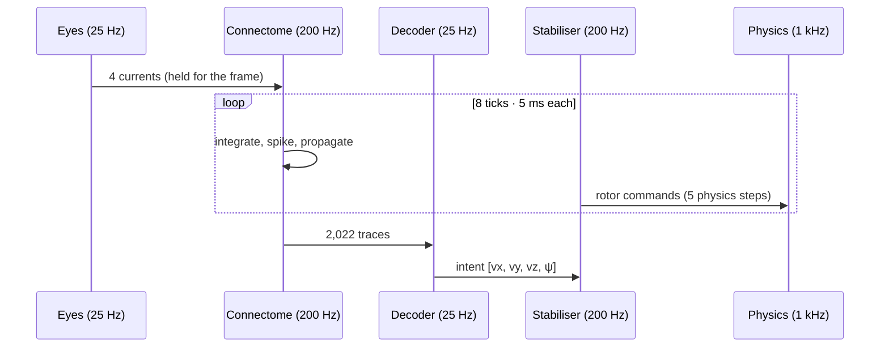

# Fly / Drone overview: a fly connectome as the brain of a drone

> **Goal.** The fly's connectome is the brain, and the drone is its body: a cyborg. A frozen
> 166,700-neuron MaleCNS connectome sees through the drone's cameras, and the drone moves
> because of what the brain's descending and motor neurons do. The drone contributes reflexes
> (stabilisation), never decisions.

For diagrams, open [`architecture.html`](architecture.html) in a browser. This file is the
written companion: architecture, math, training, evidence and roadmap. The deep references are
[`../architecture.md`](../architecture.md), [`../sensory-model.md`](../sensory-model.md),
[`../neuron-model.md`](../neuron-model.md), [`../control-and-physics.md`](../control-and-physics.md),
[`../training.md`](../training.md), [`../free-roam.md`](../free-roam.md) and
[`../validation.md`](../validation.md).

## 1. The goal, stated as a contract

"The brain controls the drone" is easy to fake: script the drone and let the neurons flicker on a
screen. Each clause below exists to rule out one way of faking it.

| Clause                                                                                                                           | Rules out                                                                    | Enforced by                                               |
| -------------------------------------------------------------------------------------------------------------------------------- | ---------------------------------------------------------------------------- | --------------------------------------------------------- |
| **Only neurons reach the decoder.** Input is the 2,022 descending + VNC motor traces.                                            | A decoder that secretly reads pose, target position or pixels                | `BrainRuntime.features`, actor identity binding           |
| **The connectome is frozen.** Wiring, weights, signs, neuron parameters and tonic bias never change.                             | "Training the brain" into an arbitrary network that merely has 166,700 units | PPO and imitation update the decoder only                 |
| **One decoder, no mode switch.**                                                                                                 | A hidden state machine choosing behaviours                                   | the server loads one free-roam actor                      |
| **The body only executes.** The PID keeps the drone upright and tracks the intended velocity.                                    | A planner in the body                                                        | the PID sees true state but receives only velocity intent |
| **Skills are causal.** A skill counts only if silencing its pathway removes it, and a blind (ghost) brain cannot pass by chance. | Behaviour that would happen anyway, such as drifting out of a ball's path    | pre-registered `roam_eval.ACCEPTANCE`                     |
| **Honest teachers.** Labels use simulator geometry only for objects the eyes can see.                                            | Asking neurons to encode information that never entered them                 | `teacher.visible`, range gates                            |

**Where the goal leads.** The same brain should forage for light, avoid pillars and walls, and
dodge thrown objects in arenas it has never seen, with every skill attributable to neurons.
After that: body feedback into the connectome through ascending neurons, richer senses, and
onboard compute running the full graph (§10).

**What is not biological, and is declared as such.** The visual encoder is an engineered adapter
(two image statistics per eye). The decoder is a learned translation, because flies have wings,
not rotors. The stabiliser uses ideal simulated state.

## 2. System at a glance

| Layer                          | Code                                                | Frozen or learned          |
| ------------------------------ | --------------------------------------------------- | -------------------------- |
| Rendering, physics, rotors     | `python/fly_drone/plant.py`, `vendor/mujoco-drones` | simulator                  |
| Encoder (pixels → 4 currents)  | `crates/brain-core/src/vision.rs`                   | frozen (`ENCODER_VERSION`) |
| Connectome (LIF)               | `crates/brain-core`                                 | frozen                     |
| Feature readout (2,022 traces) | `python/fly_drone/brain.py`                         | frozen                     |
| Decoder (actor)                | `training.py`, `distill.py`, exported to Rust       | **learned**                |
| Stabiliser                     | `plant.py`, `stabiliser.py`                         | fixed, privileged          |
| Teacher, reward, evaluation    | `teacher.py`, `env.py`, `roam_eval.py`              | simulator, offline only    |

## 3. Senses: pixels to input currents

Two 64 × 48 px cameras are splayed ±0.75 rad, which gives a 177° field with a ±2.6° binocular
overlap. For each eye (P = 3,072 px), using Rec. 709 luma $Y \in [0,1]$:

$$
B = \frac{1}{P}\sum_{px} 400\,\max(0,\,Y-0.55), \qquad D = \frac{1}{P}\sum_{px} \mathbb{1}[Y<0.18]
$$

$$
c_\text{light} = \operatorname{clamp}\!\big(1.5B + 6\max(0,\,B-B'),\,0,\,2\big), \qquad
c_\text{loom} = \operatorname{clamp}\!\big(150\max(0,\,D-D'),\,0,\,2\big)
$$

The four currents `[light_l, light_r, loom_l, loom_r]` are injected into anatomically annotated cells:

| Role        | Cells | Types               |
| ----------- | ----: | ------------------- |
| `light_l`   | 1,903 | Tm3 1,017 · Mi1 886 |
| `light_r`   | 1,924 | Tm3 1,037 · Mi1 887 |
| `looming_l` |   165 | LPLC2 94 · LC4 71   |
| `looming_r` |   146 | LPLC2 91 · LC4 55   |

**Why dark-area growth reads as looming.** An object of radius $R$ at distance $d$ subtends
$\theta \approx 2R/d$, so its image area is $D \propto 1/d^2$. Closing at speed $v$ gives
$\dot D \propto 2v/d^3$, which rises steeply near contact, like the time-to-contact tuning attributed
to LC4/LPLC2. With gain 150 the looming cells fire at about 1.5–2 m.

## 4. Brain: the frozen connectome

Leaky integrate-and-fire neurons, exact per-tick integration with $\Delta t = 5$ ms and $\tau_m = 20$ ms:

$$
v_i(t{+}1) = e^{-\Delta t/\tau_m}\,v_i(t) + I^\text{syn}_i(t) + I^\text{inj}_i(t) + b_i + \sigma\xi_i(t),
\qquad \text{spike and reset if } v_i \ge 1
$$

$$
I^\text{syn}_j(t{+}1) \mathrel{+}= \sum_{i \to j} q_{ij}\, w_\text{norm}\, \text{sign}_i, \qquad w_\text{norm}=0.003
$$

Signs follow each neuron's predicted transmitter (ACh +1; GABA and glutamate −1). Every synapse
delays by exactly one tick. The decoder reads a 200 ms exponential activity trace, which is the
brain's short-term memory.

| Neuron group                                 |     Count | Share |
| -------------------------------------------- | --------: | ----: |
| optic lobe intrinsic                         |    89,403 | 53.6% |
| central brain intrinsic                      |    32,164 | 19.3% |
| VNC intrinsic                                |    13,161 |  7.9% |
| visual projection                            |     9,201 |  5.5% |
| sensory (optic lobe, VNC, central brain)     |    17,336 | 10.4% |
| **descending neurons**                       | **1,314** |  0.8% |
| **VNC motor neurons**                        |   **708** |  0.4% |
| other (ascending, centrifugal, endocrine, …) |     3,413 |  2.0% |

Details: [`../neuron-model.md`](../neuron-model.md).

## 5. From neurons to rotors: what the drone is told

**Which fly actions map to the drone?** No neuron is hand-assigned to a rotor or an axis. A fly
steers with wings, and a quadrotor has four velocity-like degrees of freedom, so the mapping is
**learned**: a small decoder reads the activity of the cells that carry the brain's motor commands
(all 1,314 descending neurons and 708 VNC motor neurons) and outputs motion intent.

$$
\hat x = (f - \mu) \oslash \sigma, \qquad
a = \operatorname{clamp}\!\big(W_3 \tanh(W_2 \tanh(W_1 \hat x + b_1) + b_2) + b_3,\,-1,\,1\big)
$$

$$
u = a \odot [0.7,\ 0.5,\ 0.3,\ 0.8] = [v_x\ (\text{m/s}),\ v_y,\ v_z,\ \dot\psi\ (\text{rad/s})]
$$

| Axis               | Drone motion   | Free-roam limit | Legacy-room limit |
| ------------------ | -------------- | --------------: | ----------------: |
| $a_0 \to v_x$      | forward / back |         0.7 m/s |           0.4 m/s |
| $a_1 \to v_y$      | sidestep       |         0.5 m/s |           0.4 m/s |
| $a_2 \to v_z$      | climb / dive   |         0.3 m/s |           0.2 m/s |
| $a_3 \to \dot\psi$ | turn           |       0.8 rad/s |         0.8 rad/s |

The anatomical readouts (wing, thrust, steer, escape; 2–30 cells each) drive only the illustrative
fly in the viewer, and they have no effect on the drone.

**Body.** Velocity intent integrates into a bounded position-hold setpoint. A cascaded PID (position
→ attitude → torques) and a mixer produce four rotor speeds. Vertical is direct thrust. Lateral
motion needs the airframe to tilt first, so it is slower. Measured time to reach 80% of a commanded
step is 0.69 s vertical and 1.48 s lateral (`docs/results/roam-step-response.json`).

**Clocks.** Physics runs at 1 kHz, brain and PID at 200 Hz, camera and decoder at 25 Hz. One decision
takes 40 ms, 8 neural ticks and 40 physics steps.

## 6. The free-roam world

A 16 × 16 m room with 3 m walls carrying a dark band, up to 16 ringed pillars, one glowing beacon at a
time (half spawn out of view, so the drone must search), and at level 3 dark balls thrown at the drone.
Threats launch 3–4 m ahead at 0.9–1.3 m/s on an intercept course that leads the drone's velocity.
Crashes respawn the drone without resetting the brain. Full tuning evidence: [`../free-roam.md`](../free-roam.md).

## 7. How the decoder learns (and yes, it is RL)

Two stages, both touching **only the decoder**.

### 7.1 Imitation warm start: DAgger

RL from scratch on 2,022 noisy traces is sample-hungry. A composite **teacher** gives a target
action from simulator geometry, but only for objects the eyes could see:

| Drive    | Fires when                                 | Label                                                                                    |
| -------- | ------------------------------------------ | ---------------------------------------------------------------------------------------- |
| Evade    | threat in view, unoccluded, within 2 m     | back off 0.5, sidestep away, **climb** (dive near the ceiling), side committed per throw |
| Avoid    | pillar < 1.2 m or wall < 2.0 m inside ±35° | full turn away, committed until clear; forward ∝ clearance                               |
| Approach | beacon in view, unoccluded, < 12 m         | yaw 1.5β, forward when facing                                                            |
| Explore  | nothing salient                            | forward 0.8, random yaw cast resampled every 1.5–3.5 s                                   |

DAgger alternates **collect** and **fit**. In iteration $k$ the drone is flown by the teacher with
probability $\beta_k$ and by the current student otherwise, while the teacher always writes the label.
The student therefore learns to recover from its own mistakes.
$\beta = 1 \to 0.5 \to 0.25 \to 0$. The fit is drive-balanced regression, so rare threat frames
count as much as idle flight:

$$
\mathcal L(\theta) = \frac{1}{|B|}\sum_{t\in B} w_{\text{drive}(t)}\,\big\lVert m_\theta(\hat x_t) - y_t\big\rVert^2,
\qquad w_k \propto \frac{1}{n_k},\ \ \overline{w} = 1
$$

The fit uses Adam at 1e−3 for 4,000 steps with batch 256, and 10% of flights held out with per-drive R².
Exploration std is then set small ($\log\sigma_\pi = -2.5$), so PPO starts at the clone.

### 7.2 Reinforcement learning: PPO

PPO fine-tunes the cloned decoder in closed loop on the free-roam reward (per 40 ms step):

$$
\begin{aligned}
r_t ={}& 0.05 - 0.05\lVert a_t\rVert^2 + 20\cdot\mathbb 1[\text{beacon}] + 2\,(d_{t-1}-d_t)\,\mathbb 1[\text{beacon seen}] + 0.5\cdot\mathbb 1[\text{new 1 m cell}] \\
&- 2\,e^{-c_t^2/0.2} - 2\max(0,\,|z_t-1.1|-0.5)^2 - 20\cdot\mathbb 1[\text{collision, tilt, bounds, altitude}]
\end{aligned}
$$

Here $d$ is the distance to the beacon and $c$ is the clearance to the nearest pillar or wall. Progress
pays only while the beacon is visible, so luck is not rewarded. Clipped surrogate with GAE:

$$
\rho_t = \frac{\pi_\theta(a_t\mid o_t)}{\pi_{\theta_\text{old}}(a_t\mid o_t)},\quad
L^\text{CLIP} = \mathbb E_t\big[\min(\rho_t \hat A_t,\ \operatorname{clip}(\rho_t,1\pm0.2)\hat A_t)\big],\quad
\hat A_t = \sum_l (\gamma\lambda)^l \delta_{t+l}
$$

with $\gamma = 0.99$, $\lambda = 0.95$. Free-roam PPO environments run the level-3 arena with respawn,
and exported actors carry the arena limits (`training.action_limits`).

### 7.3 Could the encoder be learned too?

Only with evidence. If the gate fails because a drive needs information the four v4 cues cannot carry,
the next step is RL fine-tuning of the encoder upstream of the connectome. That invalidates every
accepted actor, which must then be re-validated. So far every failure traced to control or arena bugs,
not perception.

Commands: [`../training.md`](../training.md) §8.

## 8. Proving the brain is flying: evaluation

`fly-drone evaluate --task free_roam` flies 50 held-out seeds for 120 s under seven brain conditions:
intact, zeroed features, shuffled features, all vision silenced, light silenced, loom silenced, and
ghost objects (visible to physics, invisible to the eyes). It also flies teacher, cue-script and
random baselines.

| ID  | Pre-registered criterion                                                                            |
| --- | --------------------------------------------------------------------------------------------------- |
| A1  | beacons/min ≥ 0.6 × teacher and ≥ 2 × best of zeroed/shuffled/vision-silenced/light-silenced/random |
| A2  | collisions/min ≤ 0.5 and ≤ 0.5 × min(loom-silenced, ghost)                                          |
| A3  | threat dodge ≥ 0.8 overall and on each side; ghost dodge ≤ 0.3 (throws that hit or came within 2 m) |
| A4  | light silencing cuts beacons ≥ 50%; loom silencing doubles collisions and keeps ≥ 50% of beacons    |
| A5  | in-arena skill probes                                                                               |
| A6  | coverage ≥ 0.4, slow fraction ≤ 0.1, yaw bias ≤ 0.25                                                |
| A7  | live server ≥ 1× real time                                                                          |

A3's ghost clause is the check that a dodge really proves sight: if balls can be escaped blind, the
dodge rate says nothing about the brain.

## 9. Where we are

| Milestone                            | Status          | Evidence                                                                            |
| ------------------------------------ | --------------- | ----------------------------------------------------------------------------------- |
| Visual steering (trial room)         | ✅ accepted     | 100%, balanced 1.00; ablations 0.00/0.00/0.17                                       |
| Looming avoidance (trial room)       | ✅ accepted     | 96%, balanced 0.92                                                                  |
| 0 · Encoder v4 sufficiency           | evidence-gated  | no perception failure found so far                                                  |
| 1 · Viewer diagnostics               | ✅              | axes, heading, velocity, command vectors                                            |
| 2 · Body step response               | ✅              | vertical 0.69 s vs lateral 1.48 s to 80%                                            |
| 3 · Teacher redesign                 | ✅              | climbing evade; committed avoid turn (collisions 2.0 → 0.1/min); random search cast |
| 4 · Teacher gate (A3 on the teacher) | 🟡 dodge passed | A3 confirmed below; collision and foraging check (`roam-feasibility`) running       |
| 5 · DAgger → PPO → evaluation        | next            | asks the user before long runs                                                      |

Threat aim decides whether dodging can prove sight (near-throw scoring, 10 seeds × 60 s, level 3):

| Throw aim                    | Teacher dodge |  Worst side | Blind teacher | Random |
| ---------------------------- | ------------: | ----------: | ------------: | -----: |
| at launch position           |          0.96 |        0.90 |   **0.57** ❌ |   0.45 |
| ahead of the drone (current) |   **0.90** ✅ | **0.83** ✅ |   **0.12** ✅ |   0.68 |

Confirmation on 20 fresh seeds (6000–6019, `runs/roam/screen-5-lead-confirm.json`), aim ahead:

| Controller             | Near throws | Dodge | Left | Right | Collisions/min |
| ---------------------- | ----------: | ----: | ---: | ----: | -------------: |
| teacher, sees threats  |          46 |  0.96 | 1.00 |  0.92 |            0.4 |
| teacher, ghost threats |          53 |  0.26 | 0.27 |  0.25 |            2.2 |
| random                 |          69 |  0.57 | 0.62 |  0.51 |            1.5 |

A3 passes on the teacher (≥ 0.8 overall and per side; ghost ≤ 0.3). The ghost margin is thin (0.26
vs 0.3), so a trained decoder's own ghost rate needs watching. Random flight dodging 0.57 does not
enter A3, but it shows that erratic movement escapes some throws: a decoder that jitters could look
better than it is, and the ghost condition is what catches that.

## 10. Next

1. Finish the teacher gate: `roam-feasibility` for collisions and foraging (the dodge part passed).
2. Realisability probe: can features (and, separately, raw cues) predict each drive's label with R² ≥ 0.5?
3. DAgger iterations 0–3, screening each student.
4. PPO fine-tune from the last student.
5. Full evaluation (A1–A7), accepted actor to `docs/results/accepted-policies.json`, viewer probe and attribution panels.
6. Later, proposed: ascending/proprioceptive feedback from the body into the connectome; senses beyond two
   luminance statistics; onboard compute that runs the full graph.
