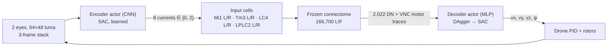

# Learned sensory encoder with SAC (encoder v5) — design

Status: **draft for user review** (2026-09-14). No code or training starts until approved.

## 1. Why

The free-roam feasibility gate failed for thrown threats, and the diagnosis points at the
encoder, not the decoder or the drone:

| Evidence (`runs/roam/feasibility-climb.json`, loom-history diagnostic, 8 × 60 s) | Value                        |
| -------------------------------------------------------------------------------- | ---------------------------- |
| Cue-only script collisions vs random                                             | 2.1 vs 1.2/min (gate < 0.5×) |
| Collisions that were thrown threats                                              | 78 of 85                     |
| Loom-triggered escapes with **no** threat in flight                              | 385 in 8 min                 |
| Median loom level at trigger: no threat / threat in flight                       | 0.49 / 0.44                  |
| Teacher (true threat geometry) near-dodge rate                                   | 0.96                         |

The v4 loom cue (`150 · max(0, ΔD)`, one scalar per eye) responds as strongly to self-motion
past banded walls and pillars as to a ball 3–4 m away. The brain receives only these four
scalars, so no decoder can recover what the encoder discarded. This is the Step 0 trigger in
`docs/overview/README.md` §7.3. The user chose to **learn** the encoder with RL (option 2) using
the Q-learning family, over evolution strategies or surrogate gradients through the LIF graph.

## 2. Principles kept

- The connectome stays frozen: wiring, weights, signs, neuron parameters, tonic bias.
- The encoder sees **only the drone's two camera images** (and its own recent frames). No
  pose, velocity, target, threat position or task id reaches the encoder or the decoder.
- The encoder speaks to the brain only by injecting bounded current into the same anatomical
  input cells as v4 (Mi1, Tm3, LC4, LPLC2), uniformly within each population.
- One encoder and one decoder for free roam. No mode switching.
- Behaviour must stay causal: silencing a pathway must remove the skill it carries; ghost must
  not pass by chance.
- Legacy actors (visual, looming, approach, track, steer_dodge, escape) stay pinned to encoder
  v4 and remain reproducible; v5 is used by free roam only unless the user later decides
  otherwise. This avoids invalidating accepted results.

## 3. Architecture



### 3.1 Channels (8, up from 4)

| Channel   | Cells (L / R) | Why separate                                       |
| --------- | ------------- | -------------------------------------------------- |
| `mi1_*`   | 886 / 887     | ON pathway                                         |
| `tm3_*`   | 1,017 / 1,037 | ON pathway, different downstream partners from Mi1 |
| `lc4_*`   | 71 / 55       | Fast looming, feeds the giant-fibre escape         |
| `lplc2_*` | 94 / 91       | Collision-selective looming                        |

v4 drove Mi1+Tm3 with one current and LC4+LPLC2 with another. Splitting by cell type lets the
encoder use distinctions the connectome already makes, at the cost of four more action
dimensions. Uniform current within a population is kept, so the encoder cannot address
individual neurons and bandwidth into the brain stays small.

### 3.2 Encoder actor

- Input: per eye, luma `Y` (as in v4) of the last 3 frames → a 6 × 48 × 64 tensor (motion needs
  frames; the history is the encoder's own, like v4's `B′`, `D′`).
- Network: 3 conv layers (16/32/32 channels, 5×5 → 3×3 → 3×3, stride 2) + 64-unit dense, shared
  weights across eyes with the side as mirrored input, then heads for 4 channels per eye.
- Output: SAC squashed Gaussian, mapped from `[-1, 1]` to currents `[0, 2]` (v4's range, so
  input cells stay in the calibrated firing range of neuron-model §3).
- Runs in PyTorch in the Python loop at 25 Hz (tiny images; CPU is enough for inference).

### 3.3 The environment each learner sees

SAC needs an `(observation, action, reward)` stream. Two views of the same `ConnectomeEnv`:

| Stage | Learner | Observation                                  | Action       | Frozen         |
| ----- | ------- | -------------------------------------------- | ------------ | -------------- |
| 2     | Encoder | eye stack (actor); + DN traces (critic only) | 8 currents   | brain, decoder |
| 3     | Decoder | 2,022 DN traces                              | 4 velocities | brain, encoder |

In stage 2 the brain and decoder are part of the environment: the brain's delays are ordinary
dynamics. The encoder's own observation (pixels) is not Markov because the brain has hidden
state, so the **critic** also receives the 2,022 DN traces. Those are neural activity, not
simulator state, and the critic is discarded after training.

**Decision for the user:** whether the critic (training only, never deployed) may also see true
threat and beacon geometry (an asymmetric critic). It usually speeds learning a lot and does not
leak into the deployed encoder. Default in this spec: **no**, until approved.

### 3.4 Reward

Unchanged free-roam reward (`docs/overview/README.md` §7.2), horizon 1,500 frames, L3 arena with
respawn. One addition for the encoder only:

```
r_enc = r − λ · mean(currents)        λ = 0.01 (tunable)
```

A small metabolic cost stops the encoder from saturating all inputs to drive the brain as a
wire. It is logged separately so its effect is visible.

## 4. Training stages

| Stage | What                                                                | Cost (6 workers)           | Output                        |
| ----- | ------------------------------------------------------------------- | -------------------------- | ----------------------------- |
| 0     | Plumbing: 8 input roles, learned-encoder hook, SAC export           | code + tests               | —                             |
| 1     | Decoder warm start: DAgger with v4 cues, **L2 (no threats)**        | ~2–3 h                     | `runs/roam/dagger/actor.json` |
| 2a    | Encoder imitation of v4 (supervised, v4 cues split onto 8 channels) | ~1 h                       | `encoder-v4-clone.pt`         |
| 2b    | Encoder SAC, decoder frozen, **L3**                                 | budget 1 M frames (~2–3 h) | `encoder-v5.pt`               |
| 3     | Decoder SAC fine-tune, encoder frozen, L3                           | budget 500 k frames        | `actor.json` (v5)             |
| 4     | Evaluation and causal tests (§5)                                    | ~1 h                       | `docs/results/`               |

Stage 2a matters: the decoder from stage 1 learned to read brain activity produced by v4
cues. Starting the encoder as a v4 clone means the decoder's inputs look familiar at the start of
2b, and SAC improves from a working system instead of noise.

Stop rules: checkpoint every 50 k frames; stop 2b early if the near-dodge rate on a fixed
validation set (10 seeds) has not improved for 300 k frames, and report before continuing.
The user is asked before starting each of stages 1, 2b and 3.

**Throughput:** the full brain runs at about real time per worker, so 6 workers give about
540 k frames per hour. SAC's replay buffer reuses those frames, which is the main reason to use
off-policy Q-learning here rather than PPO.

**Memory:** frame stacks are stored as `uint8` luma (18 KB per observation); replay buffer of
200 k with `optimize_memory_usage` ≈ 3.7 GB, plus DN traces (2,022 × float16 ≈ 4 KB) ≈ 0.8 GB.
Critic and actor updates run on the RTX 4070. Environment workers stay ≤ 6.

## 5. Evaluation

Pre-registered A1–A7 (`roam_eval.ACCEPTANCE`) apply unchanged. Silencing ablations map onto the
new channels (`loom` = LC4 + LPLC2, `light` = Mi1 + Tm3).

Proposed **new** encoder checks (additive; thresholds need user approval before any result is
seen):

| ID  | Check                                                                                                                                           | Proposed bar                           |
| --- | ----------------------------------------------------------------------------------------------------------------------------------------------- | -------------------------------------- |
| E1  | Loom selectivity: ROC AUC of max(LC4, LPLC2 currents) for "threat within 3 m and closing" vs all other frames                                   | ≥ 0.8 (v4 baseline reported alongside) |
| E2  | Channel semantics: Mi1/Tm3 currents predict beacon visibility better than threat presence, and LC4/LPLC2 the reverse                            | both hold                              |
| E3  | Brain necessity: replacing the brain's DN traces with a decoder trained directly on the 8 currents does no better than the full system on A1–A3 | reported, no bar                       |
| E4  | Legacy reproducibility: `test_legacy_room_mjcf_unchanged` and v4 accepted actors unchanged                                                      | pass                                   |

E1–E2 guard against the encoder becoming a hidden controller that uses the connectome as a wire:
the loom channels must still mean "something is coming at me".

## 6. Code changes (outline)

- `brain.py`: `ENCODER_VERSION` becomes per-runtime; `BrainRuntime(encoder="v4" | path)` builds 4
  or 8 input roles; `sense()` takes either rendered images (v4, Rust) or currents from the learned
  encoder.
- `encoder.py` (new): CNN, frame stack, v4-clone targets, save/load with a content hash that
  becomes the v5 encoder version pinned in actor JSON.
- `env.py`: `EncoderEnv` wrapper for stage 2 (obs = eye stack + DN traces dict, action = 8
  currents, decoder inside); stage 3 reuses `ConnectomeEnv` with the learned encoder.
- `training.py`: `train_sac(stage=...)` with SB3 `SAC`, `MultiInputPolicy` for stage 2; export of
  SAC's actor (`latent_pi` + `mu`, tanh-squashed) to the Rust actor format with a parity check.
- `roam_eval.py`, `cli.py`: `--encoder` option; E1–E4.
- Server: load the v5 encoder for free roam; legacy tasks keep v4.
- Tests: role sizes and disjointness; clone reproduces v4 cues on rendered frames within
  tolerance; SAC export parity; encoder version mismatch is rejected; legacy MJCF unchanged.
- Docs: `sensory-model.md` (v5 section), `overview/README.md` §3 and §7, `training.md` §8, HTML
  diagrams, `AGENTS.md` principle row for the encoder.

## 7. Risks

| Risk                                                        | Mitigation                                                                          |
| ----------------------------------------------------------- | ----------------------------------------------------------------------------------- |
| Encoder learns a control code, brain used as a wire         | Uniform per-population current, [0, 2] bound, metabolic cost, E1–E3                 |
| Non-stationarity: decoder was trained on v4-driven activity | Stage 2a clone start; stages alternate, never joint                                 |
| Sparse reward for rare throws (one every 8–20 s)            | Replay buffer; optional asymmetric critic (user decision)                           |
| Sim throughput limits SAC                                   | 6 workers, GPU updates, budgets with stop rules                                     |
| Learned encoder overfits the arena's textures               | Evaluate on unseen seeds/layouts (A5); randomise wall band contrast during training |

## 8. Open questions for the user

1. Asymmetric critic with true geometry during training only: yes or no?
2. 8 channels by cell type (this spec) or keep v4's 4 channels?
3. Proposed E1–E2 bars acceptable?
