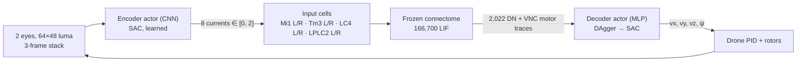

# Learned sensory encoder with SAC (encoder v5) — design

Status: **approved with amendments** (2026-09-14). Decisions recorded in §8. No training run
starts without asking the user first.

## 1. Why

The free-roam feasibility gate failed for thrown threats, and the diagnosis points at the
encoder, not the decoder or the drone:

| Evidence (`runs/roam/feasibility-climb.json`, loom-history diagnostic, 8 × 60 s) | Value                        |
| -------------------------------------------------------------------------------- | ---------------------------- |
| Cue-only script collisions vs random                                             | 2.1 vs 1.2/min (gate < 0.5×) |
| Collisions that were thrown threats                                              | 78 of 85                     |
| Loom-triggered escapes with **no** threat in flight                              | 385 in 8 min                 |
| Median loom level at trigger: no threat / threat in flight                       | 0.49 / 0.44                  |
| Teacher (true threat geometry) near-dodge rate                                   | 0.96                         |

The v4 loom cue (`150 · max(0, ΔD)`, one scalar per eye) responds as strongly to self-motion
past banded walls and pillars as to a ball 3–4 m away. The brain receives only these four
scalars, so no decoder can recover what the encoder discarded. This is the Step 0 trigger in
`docs/overview/README.md` §7.3. The user chose to **learn** the encoder with RL (option 2) using
the Q-learning family, over evolution strategies or surrogate gradients through the LIF graph.

## 2. Principles kept

- The connectome stays frozen: wiring, weights, signs, neuron parameters, tonic bias.
- The encoder sees **only the drone's two camera images** (and its own recent frames). No
  pose, velocity, target, threat position or task id reaches the encoder or the decoder.
- The encoder speaks to the brain only by injecting bounded current into the same anatomical
  input cells as v4 (Mi1, Tm3, LC4, LPLC2), uniformly within each population.
- One encoder and one decoder for free roam. No mode switching.
- Behaviour must stay causal: silencing a pathway must remove the skill it carries; ghost must
  not pass by chance.
- Legacy actors (visual, looming, approach, track, steer_dodge, escape) stay pinned to encoder
  v4 and remain reproducible; v5 is used by free roam only unless the user later decides
  otherwise. This avoids invalidating accepted results.

## 3. Architecture



### 3.1 Channels (8, up from 4)

| Channel   | Cells (L / R) | Why separate                                       |
| --------- | ------------- | -------------------------------------------------- |
| `mi1_*`   | 886 / 887     | ON pathway                                         |
| `tm3_*`   | 1,017 / 1,037 | ON pathway, different downstream partners from Mi1 |
| `lc4_*`   | 71 / 55       | Fast looming, feeds the giant-fibre escape         |
| `lplc2_*` | 94 / 91       | Collision-selective looming                        |

v4 drove Mi1+Tm3 with one current and LC4+LPLC2 with another. Splitting by cell type lets the
encoder use distinctions the connectome already makes, at the cost of four more action
dimensions. Uniform current within a population is kept, so the encoder cannot address
individual neurons and bandwidth into the brain stays small.

### 3.2 Encoder actor

- Input: per eye, luma `Y` (as in v4) of the last 3 frames → a 6 × 48 × 64 tensor (motion needs
  frames; the history is the encoder's own, like v4's `B′`, `D′`).
- Network: 3 conv layers (16/32/32 channels, 5×5 → 3×3 → 3×3, stride 2) + 64-unit dense, shared
  weights across eyes with the side as mirrored input, then heads for 4 channels per eye.
- Output: SAC squashed Gaussian, mapped from `[-1, 1]` to currents `[0, 2]` (v4's range, so
  input cells stay in the calibrated firing range of neuron-model §3).
- Runs in PyTorch in the Python loop at 25 Hz (tiny images; CPU is enough for inference).

### 3.3 The environment each learner sees

SAC needs an `(observation, action, reward)` stream. Two views of the same `ConnectomeEnv`:

| Stage | Learner | Observation                                  | Action       | Frozen         |
| ----- | ------- | -------------------------------------------- | ------------ | -------------- |
| 2     | Encoder | eye stack (actor); + DN traces (critic only) | 8 currents   | brain, decoder |
| 3     | Decoder | 2,022 DN traces                              | 4 velocities | brain, encoder |

In stage 2 the brain and decoder are part of the environment: the brain's delays are ordinary
dynamics. The encoder's own observation (pixels) is not Markov because the brain has hidden
state, so the **critic** also receives the 2,022 DN traces. Those are neural activity, not
simulator state, and the critic is discarded after training.

**Asymmetric critic (approved):** the critic (training only, never deployed) also receives threat
and beacon geometry relative to the drone, **only while the object is inside a camera's field of
view and not occluded**. Otherwise those inputs are zero and a per-object `visible` flag is 0. This
follows the honest-labels rule (only what the eyes could see) and helps with sparse throws. Nothing
from the critic reaches the deployed encoder or decoder.

### 3.4 Reward

Unchanged free-roam reward (`docs/overview/README.md` §7.2), horizon 1,500 frames, L3 arena with
respawn. One addition for the encoder only:

```
r_enc = r − λ_loom · mean(LC4, LPLC2 currents) − λ_light · mean(Mi1, Tm3 currents)
λ_loom = 0.01, λ_light = 0.002
```

A small metabolic cost stops the encoder from saturating all inputs to drive the brain as a
wire. It is split by pathway: one λ = 0.01 on all channels would cost up to 0.02 per step, 40 % of
the 0.05 alive bonus, and push the encoder to dim the light pathway that foraging needs. Loom
should be quiet unless something is coming, so it carries the larger cost. Both terms are logged
separately so their effect is visible.

## 4. Training stages

| Stage | What                                                                                         | Cost (6 workers)                                   | Output                             |
| ----- | -------------------------------------------------------------------------------------------- | -------------------------------------------------- | ---------------------------------- |
| 0     | Plumbing: 8 input roles, learned-encoder hook, SAC export                                    | code + tests                                       | —                                  |
| 1     | Decoder warm start: DAgger with v4 cues, **L2 (no threats)**                                 | ~2–3 h                                             | `runs/roam/dagger/actor.json`      |
| 2a    | Encoder imitation of v4 (supervised, v4 cues split onto 8 channels)                          | ~1 h                                               | `encoder-v4-clone.pt`              |
| 2b/3  | 3 alternating rounds: encoder SAC (decoder frozen) then decoder SAC (encoder frozen), **L3** | per round 350 k + 150 k frames (1.5 M total, ~3 h) | `encoder-v5.pt`, `actor.json` (v5) |
| 4     | Evaluation and causal tests (§5)                                                             | ~1 h                                               | `docs/results/`                    |

Stage 2a matters: the decoder from stage 1 learned to read brain activity produced by v4
cues. Starting the encoder as a v4 clone means the decoder's inputs look familiar at the start of
2b, and SAC improves from a working system instead of noise.

Why alternate: the stage 1 decoder never saw threats (L2), so it has never mapped loom-driven
brain activity to escape motion. If it stayed frozen for the whole encoder run, the only way for
the encoder to earn dodge reward would be to find brain states the decoder happens to map to
sideways or upward velocity, which is exactly the "brain as a wire" failure. Alternating lets the
decoder learn to read loom-driven activity while the encoder learns to produce it. The two are
never trained in the same round. Stage 1 stays on L2 because v4 loom cues on L3 would teach the
decoder to escape from walls.

**Critic-only warm-up.** Every round (encoder, decoder or bypass) starts with a fresh critic
signal: the replay buffer is new and, in the first round, the critic itself is untrained. Its
early gradients are noise, and a few thousand actor updates on noise can undo a warm start (the v4
clone, the round-0 decoder) before the critic has learned anything. So for the first
`ACTOR_WARMUP_FRAMES = 50_000` frames of each round (`sac.WarmupSAC`, SB3 `num_timesteps` summed
over workers) only the critic and its target train; the actor's optimizer step is skipped, so its
weights and Adam state stay bitwise unchanged. The entropy coefficient is frozen too: with a
frozen, narrow actor, auto-alpha would climb towards the target entropy for the whole warm-up and
hand the unfrozen actor a large entropy bonus. After the warm-up it is normal SAC. The actor still
collects data during the warm-up, so the critic learns the value of the warm-started behaviour
itself. `train_round(actor_warmup=...)` / `sac-round --actor-warmup` sets it (0 disables); it is
recorded in `round.json`. Since every round counts frames from 0, a round resumed from a
checkpoint repeats the warm-up unless `--actor-warmup 0` is passed.

Stop rules: checkpoint every 50 k frames. At the end of each round, compute the near-dodge rate on
a fixed validation set (10 seeds, disjoint from the 50 evaluation seeds) and E1 on those
validation seeds. Stop early and report if the near-dodge rate has not improved for a whole round.
The user is asked before stage 1 and before each round.

**Throughput:** the full brain runs at about real time per worker, so 6 workers give about
540 k frames per hour. SAC's replay buffer reuses those frames, which is the main reason to use
off-policy Q-learning here rather than PPO.

**Memory:** frame stacks are stored as `uint8` luma (18 KB per observation). SB3's
`DictReplayBuffer` does not support `optimize_memory_usage`, so it stores both obs and next_obs:
a 100 k buffer holds ≈ 3.7 GB of luma plus ≈ 0.8 GB of DN traces (2,022 × float16 ≈ 4 KB each).
Default buffer size is **100 k**; a larger buffer needs a custom buffer that stores next_obs by index.
Critic and actor updates run on the RTX 4070. Environment workers stay ≤ 6.

## 5. Evaluation

Pre-registered A1–A7 (`roam_eval.ACCEPTANCE`) apply unchanged. Silencing ablations map onto the
new channels (`loom` = LC4 + LPLC2, `light` = Mi1 + Tm3).

**New** encoder checks, pre-registered 2026-09-14 before any result (additive; they do not change
`roam_eval.ACCEPTANCE`). Frames for E1–E2 come from the 50 held-out evaluation seeds, intact
condition. A threat or beacon is _visible_ when it is inside either camera's field of view and not
occluded.

Frame labels shared by E1 and E2:

- **threat-positive:** a threat within 3 m, closing, and visible.
- **threat-negative:** no threat within 6 m.
- Frames with a threat between those (3–6 m, or within 3 m but not closing or not visible) are
  excluded from threat AUCs.
- **beacon-positive / beacon-negative:** beacon visible / not visible.

| ID  | Check                                                                                                                                                                                                                                      | Bar                                    |
| --- | ------------------------------------------------------------------------------------------------------------------------------------------------------------------------------------------------------------------------------------------ | -------------------------------------- |
| E1  | Loom selectivity: ROC AUC of max(LC4, LPLC2 currents), threat-positive vs threat-negative                                                                                                                                                  | ≥ 0.8 (v4 baseline reported alongside) |
| E2  | Channel semantics: with `light` = mean(Mi1, Tm3) and `loom` = max(LC4, LPLC2) currents, AUC(light→beacon) − AUC(light→threat) ≥ 0.05 **and** AUC(loom→threat) − AUC(loom→beacon) ≥ 0.1                                                     | both hold                              |
| E3  | Brain necessity: a decoder trained directly on the 8 currents (brain bypassed), same budget, compared with the full system on A1–A3. If the bypass does **better**, stop and report to the user before any stage 4 conclusions are written | reported, no bar                       |
| E4  | Legacy reproducibility: `test_legacy_room_mjcf_unchanged` and v4 accepted actors unchanged                                                                                                                                                 | pass                                   |

E1–E2 guard against the encoder becoming a hidden controller that uses the connectome as a wire:
the loom channels must still mean "something is coming at me".

## 6. Code changes (outline)

- `brain.py`: `ENCODER_VERSION` becomes per-runtime; `BrainRuntime(encoder="v4" | path)` builds 4
  or 8 input roles; `sense()` takes either rendered images (v4, Rust) or currents from the learned
  encoder.
- `encoder.py` (new): CNN, frame stack, v4-clone targets, save/load with a content hash that
  becomes the v5 encoder version pinned in actor JSON.
- `env.py`: `EncoderEnv` wrapper for stage 2 (obs = eye stack + DN traces dict, action = 8
  currents, decoder inside); stage 3 reuses `ConnectomeEnv` with the learned encoder.
- `training.py`: `train_sac(stage=...)` with SB3 `SAC`, `MultiInputPolicy` for stage 2; export of
  SAC's actor (`latent_pi` + `mu`, tanh-squashed) to the Rust actor format with a parity check.
- `roam_eval.py`, `cli.py`: `--encoder` option; E1–E4.
- Server: load the v5 encoder for free roam; legacy tasks keep v4.
- Tests: role sizes and disjointness; clone reproduces v4 cues on rendered frames within
  tolerance; SAC export parity; encoder version mismatch is rejected; legacy MJCF unchanged.
- Docs: `sensory-model.md` (v5 section), `overview/README.md` §3 and §7, `training.md` §8, HTML
  diagrams, `AGENTS.md` principle row for the encoder.

## 7. Risks

| Risk                                                        | Mitigation                                                                          |
| ----------------------------------------------------------- | ----------------------------------------------------------------------------------- |
| Encoder learns a control code, brain used as a wire         | Uniform per-population current, [0, 2] bound, metabolic cost, E1–E3                 |
| Non-stationarity: decoder was trained on v4-driven activity | Stage 2a clone start; stages alternate, never joint                                 |
| Sparse reward for rare throws (one every 8–20 s)            | Replay buffer; asymmetric critic with visible-only geometry                         |
| Frozen decoder never saw threats                            | Alternating encoder/decoder rounds (§4)                                             |
| Sim throughput limits SAC                                   | 6 workers, GPU updates, budgets with stop rules                                     |
| Learned encoder overfits the arena's textures               | Evaluate on unseen seeds/layouts (A5); randomise wall band contrast during training |

## 8. Decisions (user, 2026-09-14)

1. Asymmetric critic: **yes, visible-only geometry**, training only (§3.3).
2. Channels: **8 by cell type** (§3.1).
3. Training order: **3 alternating encoder/decoder SAC rounds** instead of a single 2b → 3 (§4).
4. E1–E2 definitions and bars as in §5; split metabolic cost λ_loom = 0.01, λ_light = 0.002 (§3.4).
5. Critic-only warm-up: **actor and entropy coefficient frozen for the first 50 k frames of every
   SAC round** (§4), so an untrained critic cannot wreck the warm-started actor (final review,
   Important 3).
